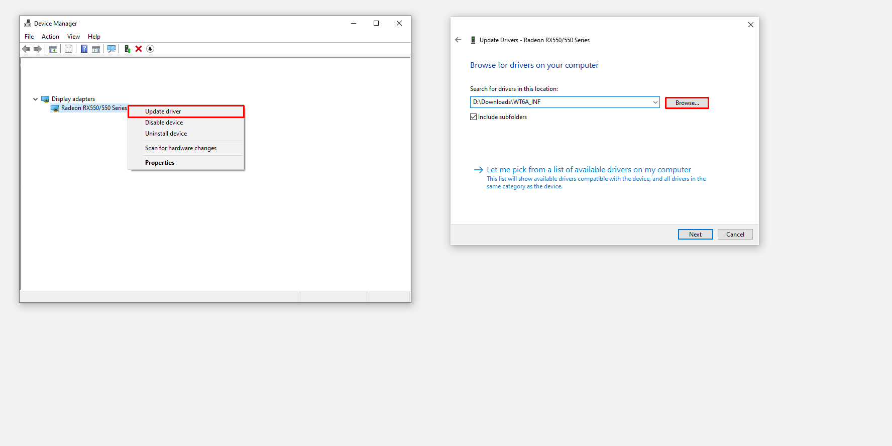
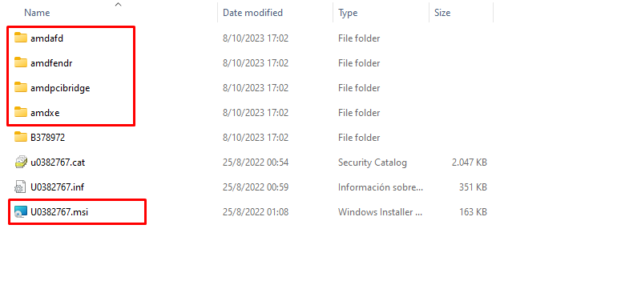

  

This guide is intended for people who do not know much about tweaking and their relationship with it is null, following the steps correctly and with awareness you will achieve an improvement in performance.

📺 Driver list
---------------
* [20.4.2 w10 & w7](https://github.com/Matishzz/AMD-Install-Drivers/releases/tag/AMD-Driver-20.4.2) 
* [20.8.1 w10 & w7](https://github.com/Matishzz/AMD-Install-Drivers/releases/tag/AMD-Driver-20.8.1)
* [21.3.1 w10 & w7](https://github.com/Matishzz/AMD-Install-Drivers/releases/tag/AMD-Driver-21.3.1)
* [22.11.2 w10 & w11](https://github.com/Matishzz/AMD-Install-Drivers/releases/tag/AMD-Driver-22.11.2)

🤖 Installation
---------------
To start we have to download the version we want to install, for now I have uploaded to Releases 4 versions of AMD along with its CNext, it is best to make a comparative benchmark with the 4 versions to see which one works best for you, also keep in mind that there are some drivers that are not compatible with some graphics cards so it will be impossible to test them.

* Once we have decided which driver to install 
* Download the Display Driver in case of w10 will be __WT6A_INF__, in w7 is called __W76A_INF__
* All we have to do is open the __Device Manager__ (Win + R = devmgmt.msc)
* Go to the __"Display adapters"__ section, right click on the "__Microsoft Display Adapter__" 
* "__Update Drivers__" and choose the option "__Browse my computer for drivers__"
* This will ask us the location of the driver that we downloaded previously unzipped we will put it
* Activate the option "__Include subfolders__" and click "__Next__", now the driver installation will start

 

🔧 AMD software installation
---------------
For some reason, if you need the AMD software although it is not recommended, it is possible to install it by means of a simple .msi that gives us the ccc2_install, the only thing we will have to do is to go to the Releases of the driver that you installed and download the "__ccc-next64.msi__" then we will execute the file (it has to be if or if the CNext of the same version that we have otherwise it will throw an error)

 <h2>🔗 Clean driver preparation  </h2> 

  
The preparation of the AMD drivers is quite simple, the only thing you need is [7zip](https://www.7-zip.org/), install the driver you want to prepare, extract it and browse the folder `AMD-Software-Adrenalin-Edition-XX.X.X\Packages\Drivers\Display\`. After that you will find **WT6A_INF** or **W76A_INF** (in the case of win7), there is the Display Driver which is in charge of the representation of the visual information you will see. 

* <b>amdfendr:</b> or AMD Crash Defender was released in version <a href="https://www.amd.com/es/support/kb/release-notes/rn-rad-win-21-4-1">21.4.1</a> and focuses on reliability and security, completely irrelevant.
* <b>amdpcibridge:</b> or AMD PCI Bridge Device works on the PCI bridge, it is related to the management of the PCI bridge. 
* <b>amdxe:</b> It is called AMD Link Controller Emulation and works for a mobile device to emulate a virtual controller or gamepad for games. 
* <b>amdafd:</b> Also known as High Definition Audio Bus is the audio driver that AMD installs (I don't use it but someone may need it). 

 

The only thing you need is the .inf, .cat and the folder BXXXXXXXX, to extract the software you have to redirect to the folder BXXXXXXXX and open with 7zip the ccc2_install.exe, inside you will see several folders the only thing you have to use is the ccc-next64.msi that is located in `CN\cnextcnext64`. Then to install the software you need to run the respective .msi and you are done.

If you want to see which graphics are compatible with the driver you can open the .inf and scroll down to find the section called "Localizable Strings" or you can go to the driver page.

  
  

