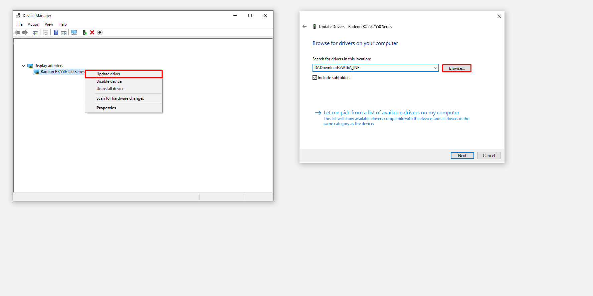
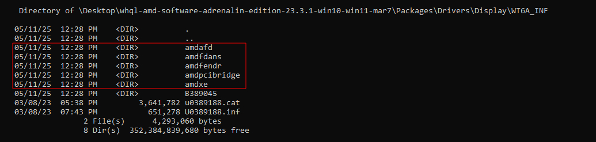

  
<h3>AMD Only Display Driver</h3>
  </a>
  

    Join/follow us on <a href="https://dsc.gg/matishzz-tweak" target="_blank">Discord</a> | <a href="https://x.com/Matishzz" target="_blank">𝕏 (Twitter)</a>
  

---

After the performance pillar argument of doing extensive testing between different configurations, and driver versions among other things, I have taken the audacity to prepare the AMD drivers to only have the Display Driver and not have the irrelevant bloatware crap that no one really wants

:tv: Driver list
---------------
* [20.4.2 w7 & w10/11](https://github.com/Matishzz/AMD-Install-Drivers/releases/tag/20.4.2)
* [20.5.1 w10/11](https://github.com/Matishzz/AMD-Install-Drivers/releases/tag/20.5.1)
* [20.8.1 w10 & w7](https://github.com/Matishzz/AMD-Install-Drivers/releases/tag/20.8.1)
* [20.9.1 w7 & w10/11](https://github.com/Matishzz/AMD-Install-Drivers/releases/tag/20.9.1)
* [20.11.2 w7 & w10/11](https://github.com/Matishzz/AMD-Install-Drivers/releases/tag/20.11.2)
* [21.10.2 w7 w10/11](https://github.com/Matishzz/AMD-Install-Drivers/releases/tag/21.10.2)
* [24.9.1 w10/11](https://github.com/Matishzz/AMD-Install-Drivers/releases/tag/24.9.1)
* [24.12.1 w10/w11](https://github.com/Matishzz/AMD-Install-Drivers/releases/tag/24.12.1)
* [25.1.1 w10/w11](https://github.com/Matishzz/AMD-Install-Drivers/releases/tag/25.1.1)
* [25.3.1 w10/11](https://github.com/Matishzz/AMD-Install-Drivers/releases/tag/25.3.1)

:robot: Installation
---------------
The two ways to install them are simple, you can install it automatically with the <code>install.bat</code> that is in the folder that will install and restart automatically when the process is finished, install it by CMD using <a href="https://learn.microsoft.com/es-es/windows-hardware/drivers/devtest/pnputil-command-syntax">pnputil</a> or manually through the device manager with the steps below
> [!WARNING]
> Before choosing the driver, make sure you have done a corresponding benchmark and also remember to analyze the DPC latency

* Once we have decided which driver to install 
* Download the Display Driver in case of w10 will be __WT6A_INF__, in w7 is called __W76A_INF__
* All we have to do is open the __Device Manager__ (Win + R = devmgmt.msc)
* Go to the __"Display adapters"__ section, right click on the "__Microsoft Display Adapter__" 
* "__Update Drivers__" and choose the option "__Browse my computer for drivers__"
* This will ask us the location of the driver that we downloaded previously unzipped we will put it
* Activate the option "__Include subfolders__" and click "__Next__", now the driver installation will start

 

:wrench: AMD software installation
---------------
For some reason, if you need the AMD software although it is not recommended, it is possible to install it by means of a simple .msi that gives us the ccc2_install, the only thing we will have to do is to go to the Releases of the driver that you installed and download the "__ccc-next64.msi__" then we will execute the file (it has to be if or if the CNext of the same version that we have otherwise it will throw an error)

:link: Clean driver preparation
---------------
  
The preparation of the AMD drivers is quite simple, the only thing you need is [7zip](https://www.7-zip.org/), install the driver you want to prepare, extract it and browse the folder `AMD-Software-Adrenalin-Edition-XX.X.X\Packages\Drivers\Display\`. After that you will find **WT6A_INF** or **W76A_INF** (in the case of win7), there is the Display Driver which is in charge of the representation of the visual information you will see. 

The only thing you need is the <code>.inf</code>, <code>.cat</code> and the folder <b>BXXXXXX</b>, all the rest are irrelevant components and you can delete them as the red ones represented in the image.

To extract the software you have to redirect to the folder <b>BXXXXXX</b> and open with 7zip the <code>ccc2_install.exe</code>, inside you will see several folders the only thing you have to use is the <b>ccc-next64.msi</b> that is in `ccc2_install.exe\CN\cnext\cnext64\`. Then to install the software you have to run the corresponding <code>.msi</code> and you are done.

If you want to see which graphics are compatible with the driver you can open the .inf and scroll down to find the section called <i>Localizable Strings</i> or you can go to the driver page.
